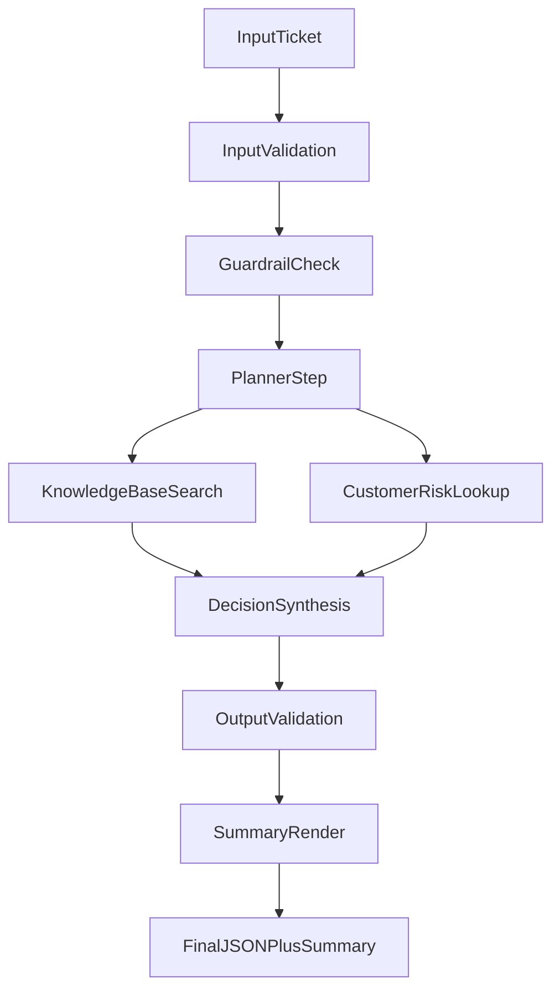

# AI Support Triage Agent (Test Project)

## Problem Statement
Support teams receive high volume inbound tickets and need a fast, standardized first-pass triage.
This project demonstrates a multi-step support triage agent that produces strict JSON and a human-readable summary.

## Scope / Non-scope
- Scope: ticket intake, classification, prioritization, next action, response draft, observability, tests.
- Non-scope: production message sending, live CRM/helpdesk integration, fully autonomous ticket closure.

## Business Cases Covered
- Account access issues.
- Billing anomalies.
- Security incidents.
- Bug reports and general support requests.

## Architecture and Data Flow

Core modules:
- `src/agent/orchestrator.ts`: pipeline orchestration, retry, and deterministic checks.
- `src/tools/*`: mock tool implementations.
- `src/guardrails/refusal.ts`: refusal and safety rules.
- `src/schemas/*`: strict input/output validation via zod.
- `src/observability/logger.ts`: structured logs and verbose mode.

## Setup (Local Run)
1. `npm install`
2. `npm start -- samples/input/password-reset.json --verbose`

Expected output: validated triage JSON printed to stdout.

## Test / Verification Steps
- Unit tests: `npm test`
- E2E test: `npm run test:e2e`
- Manual scenario:
  - run `npm start -- samples/input/password-reset.json`
  - verify `toolsUsed` includes `knowledgeBaseSearch` and `customerRiskLookup`
  - verify `summary` and `nextAction` are present

## Example Input / Output
- Input sample: `samples/input/password-reset.json`
- Expected shape hints: `samples/expected/password-reset.expected.json`

## Trade-offs, Limitations, Next Steps
- Uses deterministic local mock tools instead of real backends.
- Prioritization logic is intentionally simple and rule-based.
- No real auth, RBAC, PII policy engine, or external audit sink.
- Next steps:
  - integrate real KB/CRM connectors,
  - add role-based authorization and policy controls,
  - add HITL approval workflow and incident playbooks.

## Real-world Usage
Not in production today.
This architecture can fit businesses such as SaaS helpdesks, fintech customer operations, and e-commerce support centers.
Before production use, it requires hardened security, reliable monitoring and alerting, governed data access, human-in-the-loop controls, and compliance alignment.
